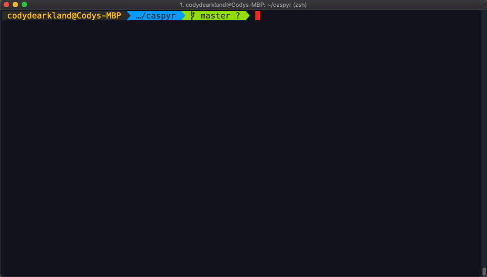

[](https://circleci.com/gh/vmware/caspyr)

# Cloud Automation Services SDK for Python (Caspyr)

This is a set of Python (3.6 minimum version) bindings for VMware Cloud Automation Services (Cloud Assembly, Service Broker, Code Stream) meant to simplify programmatic consumption of it's API interfaces.



These bindings simplify the utilization of many of the common endpoints within the CAS API. Some of these common endpoints include...

* Blueprints
* Projects
* Deployments
* Machines
* Pipelines
* Network Profiles
* Cloud Accounts/Zones

Currently this SDK is used for the VMware Hands on Labs as well as internal Marketing and Training environments to automate the full deployment and configuration of CAS environments.

## Requirements for Usage

* Python 3.6
* This Repository
* API Key with sufficient permissions to the Cloud Automation Services platform

## Getting Started

Clone this repository and install leveraging the setup.py file.

```bash
python3 setup.py install
```

Once installation is complete, Import the appropriate modules/libraries in order to begin interacting with the platform. Example import statement is below

```python
from caspyr import Session, User, Region
from caspyr import CloudAccountAws, CloudAccountAzure, CloudAccount
from caspyr import CloudZone, ImageMapping, FlavorMapping
from caspyr import NetworkProfile, StorageProfileAWS, StorageProfileAzure, StorageProfile
from caspyr import Project, Request, Deployment, Blueprint, Machine
```

From here, we will authenticate to the Cloud Services Platform by establishing an object for we can interact with.

```python
s = Session.login(api_token)
```

With this object instantiated, we can leverage other calls, passing the session object in to return data. Examples can be found in the examples directory.

### Listing all Current Deployments

```python
s = Session.login(api_token)
d = Deployment.list(s)
```

### Listing all Projects

```python
s = Session.login(api_token)
p = Projects.list(s)
```

Documentation is forthcoming (PR's welcome!)

## Maintainers

Grant Orchard ([@grantorchard](https://twitter.com/grantorchard))
<br>
Cody De Arkland ([@codydearkland](https://twitter.com/codydearkland))
